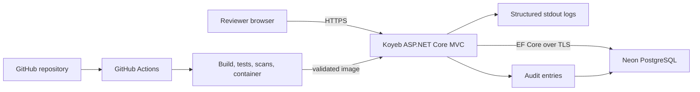
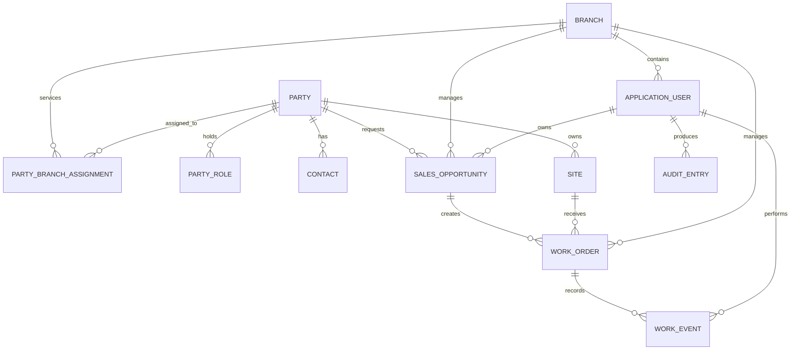

# FieldOps Portal Public Portfolio Design

**Status:** Approved in conversation on 2026-08-11
**Project:** FieldOps Portal
**Repository working name:** `FieldOps-Portfolio`
**Audience:** Hiring managers and engineers evaluating intermediate C#/.NET business-system capability

## 1. Problem and timing

The portfolio needs to demonstrate verifiable C#/.NET business-system development capability without publishing a real company's source code, customer data, internal URLs, or operational details. A hiring reviewer must be able to inspect the code, run it locally, and interact with a public demo that represents a multi-branch service company used by approximately twenty employees.

The public repository is a fictional reconstruction. It must never imply that it is the source repository of a real production system or evidence of a specific employer's confidential implementation.

## 2. Success criteria

The work is complete only when all of the following are evidenced:

1. A public GitHub repository exists and contains source, tests, Docker setup, architecture documentation, data model documentation, operations guidance, and verification reports.
2. A public Koyeb deployment is reachable over HTTPS and uses Neon PostgreSQL.
3. A reviewer can use one-click login for four roles: System Administrator, Branch Manager, Sales Representative, and Field Technician.
4. The application contains distinct pages for dashboard, parties, customers, business partners, sales opportunities, work orders, work history search, branches, users, audit history, and settings.
5. Authorization prevents cross-role and cross-branch operations not listed in the permission matrix.
6. Only a System Administrator can run the `初期化` operation.
7. Reset is confirmed, visibly loading, single-flight, transactional, auditable, and fully rolled back on failure.
8. Unit, integration, security, concurrency, E2E, and release smoke tests pass.
9. The declared 20-user baseline and 100-user stress scenarios complete with zero HTTP 500 responses, zero unhandled exceptions, and zero detected data-integrity failures.
10. Role-specific subagents complete E2E testing; discovered defects are returned to an implementation agent, retested by the reporter, and independently verified.
11. The declared test matrix has zero known open defects at release time.
12. No secret, token, connection string, real customer record, or private company fact exists in the repository or public demo.

## 3. Scope

### Included

- Integrated operational dashboard
- Party, customer, business-partner, contact, and site management
- Sales-opportunity and progress management
- Work-order and work-event management
- Multi-condition work-history search
- Branch management
- User and role administration
- Branch-scoped authorization
- Audit history
- Administrator-only demo-data reset
- Structured technical logs and correlation identifiers
- Liveness and readiness health endpoints
- Docker-based local environment
- GitHub Actions validation and deployment workflow
- Unit, integration, E2E, security, concurrency, failure, and load tests
- Public GitHub and public demo deployment
- Japanese-first documentation with a short English project summary

### Excluded

- Real customer, employee, company, credential, or production data
- Source code copied from an actual internal system
- Accounting, payroll, payment processing, or real invoicing
- Real email, SMS, or push-notification delivery
- Native desktop or mobile applications
- A 24x7 availability or paid SLA claim
- A claim that the free public instance itself sustains 100 concurrent users
- Microservices, Kubernetes, message brokers, or event sourcing

## 4. Constraints and dependencies

- Recurring hosting budget is zero.
- Koyeb Free provides the ASP.NET Core container and may scale to zero after inactivity.
- Neon Free provides PostgreSQL and may suspend inactive compute.
- The public demo may have a cold start; the UI and README must explain it without treating it as an application error.
- The Koyeb free instance is not the load-test target. Load tests run against the same Docker image in a controlled local or CI environment.
- GitHub, Koyeb, and Neon accounts and their deployment credentials are required only at the publication stage.
- GitHub secrets hold deployment credentials; secrets never enter source-controlled files or test artifacts.
- All timestamps are stored in UTC and rendered in Asia/Tokyo for the demo.

## 5. Architecture



The application is a modular monolith. This preserves clear feature boundaries while keeping the free deployment, transactions, and debugging understandable.

### Technology baseline

- .NET 10 and C#
- ASP.NET Core MVC and Razor Views
- Bootstrap for responsive, accessible business UI
- Entity Framework Core with the Npgsql PostgreSQL provider
- ASP.NET Core Identity and cookie authentication
- Built-in structured JSON logging with correlation middleware
- Docker multi-stage build
- xUnit for unit and integration tests
- Playwright for browser E2E tests
- k6 for baseline and stress scenarios

### Project boundaries

```text
src/
  FieldOps.Web/             MVC entrypoint, views, middleware, policies
  FieldOps.Features/        Feature-oriented application logic
  FieldOps.Domain/          Entities, statuses, invariants
  FieldOps.Infrastructure/  EF Core, Identity, seed data, logging adapters
tests/
  FieldOps.UnitTests/
  FieldOps.IntegrationTests/
  FieldOps.E2ETests/
  load/
docs/
  architecture/
  operations/
  testing/
```

Dependencies point inward: Web and Infrastructure depend on Features and Domain; Domain depends on no application-specific infrastructure.

## 6. User experience and navigation

The accepted layout is an integrated dashboard with left navigation. It is the entry page, not the entire application.

Primary pages:

- `/dashboard`
- `/parties`
- `/customers`
- `/business-partners`
- `/sales-opportunities`
- `/work-orders`
- `/work-history`
- `/branches`
- `/admin/users`
- `/admin/audit`
- `/admin/settings`

The header contains the current branch, signed-in demo role, account menu, and administrator-only `初期化` button. Search-first work history and branch-progress views are full pages reachable from the navigation and dashboard cards.

## 7. Demo authentication

The login page exposes four one-click role buttons. Each button sends an anti-forgery-protected POST to a demo-only sign-in endpoint. The server signs in a seeded demo identity through ASP.NET Core Identity without transmitting or displaying a password.

Demo bypass behavior is enabled only when `DemoMode` is true. Application startup fails closed if `DemoMode` is true without the approved demo dataset configuration. The repository documents that this convenience login must not be enabled for a real production system.

## 8. Domain model

The canonical glossary is maintained in `/CONTEXT.md`.

### Core entities

**Branch**
- Unique code and name
- Active status
- Soft-delete metadata

**ApplicationUser**
- ASP.NET Core Identity fields
- Display name
- Branch reference
- One assigned demo role
- Active status

**Party**
- Person or organization type
- Display and normalized search names
- Contact summary and address fields
- Active and soft-delete metadata
- Concurrency token

**PartyRole**
- Customer, BusinessPartner, Supplier, Subcontractor, or ReferralSource
- A party may hold multiple roles without duplicate master records

**PartyBranchAssignment**
- Party and branch references
- Grants a branch permission to service and maintain a party
- Allows one party to be shared across multiple branches without duplicating the party record

**Contact**
- Party reference
- Name, title, phone, and email using fictional data only
- Primary-contact flag

**Site**
- Customer party reference
- Site name and fictional address
- Access and service notes

**SalesOpportunity**
- Customer, branch, owner, and optional site references
- Opportunity number
- Title, expected date, value band, status, loss reason, and hold reason
- Concurrency token

**WorkOrder**
- Source opportunity, customer, site, branch, and assigned technician references
- Work-order number
- Work type, schedule, completion date, status, and summary
- Concurrency token

**WorkEvent**
- Work-order and performer references
- Event type, performed time, notes, and outcome

**AuditEntry**
- Actor, branch, action, entity type, entity identifier, outcome, timestamp, correlation identifier, and sanitized change summary
- Immutable after insert

### Relationships



### Status transitions

Sales opportunities:

```text
New -> Contacted -> SurveyScheduled -> Quoting -> Proposed -> Won
                                                -> Lost
                                                -> OnHold
```

Work orders:

```text
Planned -> Scheduled -> InProgress -> Completed
   \-------------------------------> Cancelled
```

Required invariants:

- Lost requires a loss reason.
- Completed requires a completion date and at least one work event.
- Only a won sales opportunity may create linked work orders.
- A referenced party, site, branch, or user cannot be physically deleted.
- Concurrent edits never silently overwrite newer data.
- Audit entries are written in the same transaction as the corresponding business change.

## 9. Authorization matrix

| Capability | System Administrator | Branch Manager | Sales Representative | Field Technician |
|---|---:|---:|---:|---:|
| View all branches | Yes | No | No | No |
| View own branch | Yes | Yes | Yes | Yes |
| Edit parties | Yes | Own branch | Own branch | Read only |
| Edit opportunities | Yes | Own branch | Assigned/owned | Read only |
| Edit work orders | Yes | Own branch | Read only | Assigned |
| Manage users | Yes | Own branch | No | No |
| View audit entries | Yes | Own branch | No | No |
| Run demo reset | Yes | No | No | No |

Authorization is enforced both in navigation visibility and server-side policies. Direct URL, crafted-form, and record-identifier tests must prove that hidden controls are not the security boundary.

## 10. Demo reset design

1. The System Administrator selects `初期化`.
2. The UI shows an explicit confirmation dialog.
3. After confirmation, a full-page loading overlay prevents duplicate interaction.
4. The server verifies authentication, role, anti-forgery token, and demo mode.
5. PostgreSQL obtains an exclusive reset advisory lock so only one reset can run. Every normal mutation obtains the matching shared transaction lock, preventing writes from overlapping reset.
6. A transaction replaces mutable demo data and restores the approved seed version.
7. A successful reset writes its audit entry inside the reset transaction. After a rollback, a failure event is logged and a separate failure audit is attempted only if database connectivity remains available.
8. Success redirects to the dashboard with a completion notification.
9. Failure rolls back all mutable data changes and shows a safe error containing the correlation identifier.

Concurrent reset requests receive a conflict response. Normal writes either finish under a shared lock before reset obtains its exclusive lock or wait up to a short timeout and receive a clear temporary-unavailable result. Reads observe a consistent pre-reset or post-reset database snapshot.

## 11. Search and performance design

Work-history search supports branch, customer, site, work-order number, work type, status, technician, scheduled date range, completion date range, and free text. Results are server-paged and deterministically ordered.

Indexes cover unique business numbers and common compound filters, including branch plus status/date and customer plus date. Queries project only list fields, avoid tracking for reads, and have bounded page sizes. Detail views load related records explicitly instead of returning unbounded graphs.

## 12. Logging, audit, and health

Technical logs are structured JSON written to stdout. Every HTTP request receives a correlation identifier returned in response headers and safe error pages.

Logged events include:

- Request start, completion, status, and duration
- Authentication outcome and authorization denial without credentials
- Business-operation start, completion, and duration
- Database operation duration and transient failure
- Concurrency conflict
- Reset phase, lock result, rollback, and completion
- Health-check state
- Load-test threshold failure

Passwords, cookies, tokens, connection strings, and raw request bodies are never logged. Business audit entries are stored separately in PostgreSQL and contain only a sanitized change summary.

Endpoints:

- `/health/live`: process liveness without a database dependency
- `/health/ready`: database connectivity and migration readiness

## 13. Error handling

- Validation failures return the same form with field-level messages.
- Unauthorized requests return 401 or redirect to demo login.
- Forbidden operations return 403 without revealing record existence across branches.
- Missing allowed records return 404.
- Concurrency and reset-lock conflicts return 409 with recovery guidance.
- Rate limiting returns 429.
- Unhandled failures return a safe 500 page with the correlation identifier.
- Transient database failures receive bounded retries only when replay is safe.
- All commands accept cancellation tokens and have configured timeouts.

## 14. Testing and quality gates

### Automated tests

- Unit tests: invariants, transitions, validation, and authorization decisions
- Integration tests: PostgreSQL mappings, transactions, audit atomicity, reset, constraints, and concurrency
- E2E tests: role login, navigation, CRUD, search, direct URL denial, reset, and logout
- Security tests: anti-forgery enforcement, cross-branch identifier access, unsafe input, and secret scanning
- Failure tests: database unavailable, timeout, reset interruption, and recovery

### Load tests

Baseline scenario:

- 20 concurrent virtual users for 10 minutes
- Mixed search, list, detail, create, and update workflow
- Zero HTTP 500 responses
- Zero unhandled exceptions
- Zero detected integrity failures
- p95 response time target of one second

Stress scenario:

- 100 concurrent virtual users for 5 minutes
- 70 percent read/search, 20 percent create/update, 10 percent dashboard
- Zero HTTP 500 responses
- Zero unhandled exceptions
- Zero detected integrity failures
- p95 response time target of two seconds

The report records hardware, container configuration, dataset size, command, timestamps, percentiles, throughput, and all threshold results. It does not present controlled-environment results as a guarantee for the free Koyeb instance.

### Concurrency scenarios

- Twenty users update one record; one valid winner and explicit conflicts are expected.
- Multiple reset submissions result in one reset and conflict responses for the rest.
- Normal access during reset remains consistent and recoverable.
- Database loss during a write leaves no partial business or audit change.

## 15. Subagent verification workflow

Role-specific testing is performed by subagents separate from the implementation agent. Because available concurrency is bounded, roles may be tested in waves, but every role receives its own signed-off report.

1. Implementation agent completes a testable increment.
2. Administrator, Branch Manager, Sales Representative, and Field Technician E2E agents execute their role matrices.
3. Each defect report includes role, reproduction steps, expected and actual behavior, screenshot, correlation identifier, relevant sanitized logs, and reproduction rate.
4. The implementation agent fixes confirmed defects.
5. The original reporter reruns the reproduction and the relevant regression suite.
6. An independent verifier confirms declared acceptance evidence.
7. Release proceeds only with all declared tests passing and zero known open defects.

No report may claim that unknown defects are impossible.

## 16. CI/CD and release

Pull requests run restore, build, formatting verification, unit tests, PostgreSQL integration tests, E2E smoke tests, secret scanning, and dependency checks.

Main-branch release runs the full suite, builds the Docker image, deploys only validated output, and executes public health and smoke checks. Full load tests run in a controlled manual release workflow; a short load smoke runs in routine validation.

Artifacts retain test results, coverage, Playwright traces on failure, load reports, and the release verification summary. Deployment is not complete until the public URL, role logins, reset, health endpoints, database persistence, and logs have been read back.

## 17. Edge cases

- One party holds both Customer and Business Partner roles.
- An individual customer has no organizational contact record.
- One customer owns multiple sites across branches.
- A won opportunity produces multiple work orders.
- A soft-deleted party remains visible on historical work.
- A branch manager guesses another branch's identifiers.
- A technician's assignment changes while a detail page is open.
- Two users complete the same work order simultaneously.
- Reset occurs while a user is editing stale data.
- Koyeb and Neon cold-start independently.
- Database connectivity returns after a transient outage.
- Seed data version changes between releases.
- Browser refreshes after a reset POST without repeating the operation.

## 18. Build sequence

1. Repository foundation, solution structure, Docker, and CI skeleton
2. PostgreSQL context, migrations, seed version, and Identity
3. Role policies and one-click demo login
4. Party, role, contact, and site management
5. Sales-opportunity workflow
6. Work-order and work-event workflow
7. Search, paging, and indexes
8. Dashboard and branch-progress views
9. Audit, structured logs, health checks, and reset
10. Unit and integration coverage
11. E2E, security, concurrency, failure, and load suites
12. Role-specific subagent verification and repair loop
13. Documentation and evidence packaging
14. GitHub publication
15. Koyeb and Neon deployment
16. Public artifact verification

## 19. Risks and recovery

- **Free-tier changes:** Docker and environment-variable configuration allow migration to another container host; Neon data can be exported.
- **Cold-start confusion:** Public landing page and README state the expected first-load delay.
- **Public demo abuse:** Rate limiting, bounded dataset, admin-only reset, no real data, and audit evidence limit impact.
- **Secret exposure:** Local secret files are ignored; CI scans history and source before publication.
- **Load-test overclaim:** Reports identify the exact controlled environment and separate it from free-host performance.
- **Migration failure:** Deployment health requires migration readiness; rollback uses the prior image and database backup/branch where available.

## 20. Open questions

No product-design questions remain. External account creation, secret provisioning, and the final public repository creation are execution-stage actions and require exact-target confirmation immediately before publication.
